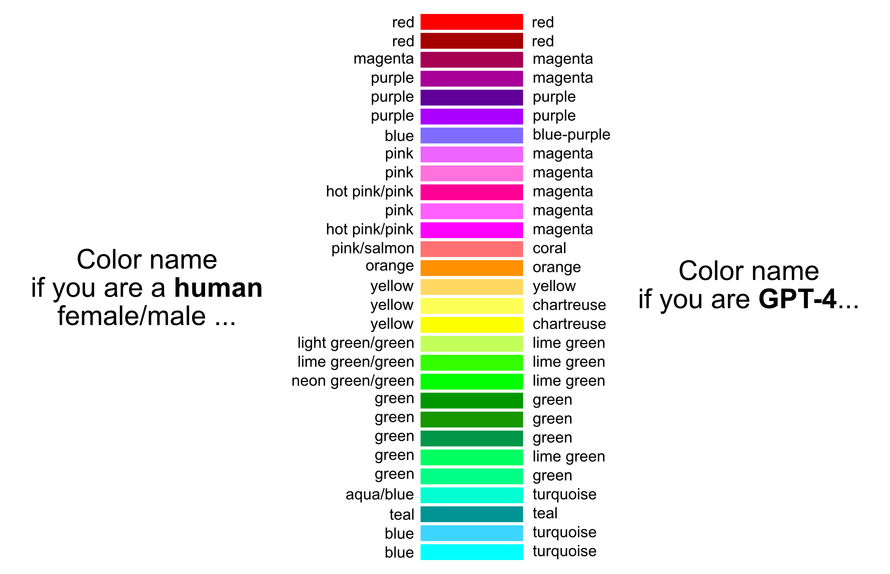

One of the most interesting questions you can ask young children is, "Tell me what color this is?"

It's quite amusing what answers you might receive as they learn to classify their visual input according to our cultural standards.
I sometimes like to think of our current AI models as young children—but with rhetorical superpowers.
They are eager to answer all our questions, regardless of knowing if they are right or wrong.

So, a new idea was born: **Let's ask ChatGPT to tell us what color it sees and compare it to human color naming in a small-scale experiment**.

For this purpose, I used the [GPT-4 Turbo with Vision API](https://platform.openai.com/docs/guides/vision/vision) to run an experiment, showing the model more than 1,000 images, each in a different color.

I've then compared the responses from GPT-4 with the results of the [Color Survey](https://blog.xkcd.com/2010/05/03/color-survey-results/) conducted in 2010 by Randall Munroe, the author of the popular web comic [xkcd](https://xkcd.com).

## Results 



**In summary the model agrees with humans most of the time.**

This might seem like a mundane result, but if we are to build AI systems that align with human understanding, it's reassuring that we won't have disagreements over color names.

In fact, this alignment is quite useful when working with documents that include images, such as PDFs in the fields of science and engineering.

A common use case for me involves analyzing PDFs containing graphs, diagrams, and photos. Asking ChatGPT to identify all images containing a green cable and to determine its possible function is a useful skill for an AI model. (However, remember to double-check the results.)

But as always, with LLMs, there are some [limitations](https://platform.openai.com/docs/guides/vision/limitations), and the one I found is the following.

### The Pink Elephant in the Room

GPT-4 failed to name any of the *pinkish* colors as a human would.

Because of this odd observation I've repeated these experiments for all the colors in the results graph above 10 times and never received pink as an answer.

For most colors in this group, the results were a mix of *magenta* and sometimes *fuchsia,* with *magenta* always the clear winner.

In total I've tested around 1,000 different colors, see [More Results](#more-results), and I noted a slight aversion for the model to use *pink* in many other cases.

My best guess is that this behavior is somehow related to efforts to remove any gender-related biases in colors within large language models, but it could also just be a result of the training data, training process, and/or human feedback. 
We will probably never know for sure.

### Yellow vs. Green

Another observation is that GTP-4 has some issues to name the color  *yellow* correctly. 

Yellow is sometimes named as *chartreuse*, the name of a French herbal liqueur. 
In the full data this name comes up 17 times for different hues of yellow. 
Generally speaking, GPT-4 drifts towards the *greenish* color names, such as *lemon*, *lime yellow*.

A follow up experiment that measures the distances of the embeddings for these color images might help us to understand how GPT-4 understands colors and the color space better. 

Let me know if you are interested in such an article.

## The Code

If you are interested in the details, read on to learn how to run similar experiments yourself.

You can conduct your own experiments following the code snippets below.

First we have to create the images using [Pillow](https://python-pillow.org), a popular Python imaging library.

```python
from PIL import Image

# Create a image with one specific color and size
def create_image(color: str, dim_x: int, dim_y: int, image_path: str):
    image = Image.new("RGB", (dim_x, dim_y), color)
    image.save(image_path)
```

You can specify the color as a hexadecimal color code, the size of the image in pixels and the name of the output file by passing in the specific function parameters.

For example `create_image("#FED100", 128, 128, "yellow.png")` will then create a yellow square, like this.


Once we have all our image files, we can use the example code from the [OpenAI Docs](https://platform.openai.com/docs/guides/vision/uploading-base-64-encoded-images) to encode each image file in Base64, and we change the prompt so that we will get the name of the color in the image. 
In my experiments I've been using the following prompt that worked well for me: _"Name the main color in the image. Use one word or if needed two words to name the color. Only provide the name of the color as answer."_

```python
import base64
import json

import requests

# OpenAI API Key
api_key = "YOUR_OPENAI_API_KEY"

# Encode image in base64 encoded format
def encode_image(image_path: str):
    with open(image_path, "rb") as image_file:
        return base64.b64encode(image_file.read()).decode("utf-8")


# Analyze image color via GPT-4-Vision API
def analyze_color(hex_code: str):
    image_path = hex_code + ".png"
    create_image(hex_code, 128, 128, image_path)

    base64_image = encode_image(image_path)

    headers = {"Content-Type": "application/json", "Authorization": f"Bearer {api_key}"}

    payload = {
        "model": "gpt-4-turbo",
        "messages": [
            {
                "role": "user",
                "content": [
                    {
                        "type": "text",
                        "text": "Name the main color in the image. Use one word or if needed two words to name the color. Only provide the name of the color as answer.",
                    },
                    {
                        "type": "image_url",
                        "image_url": {"url": f"data:image/jpeg;base64,{base64_image}"},
                    },
                ],
            }
        ],
        "max_tokens": 300,
    }

    response = requests.post(
        "https://api.openai.com/v1/chat/completions", headers=headers, json=payload
    )

    result = response.json()
    color_name = result["choices"][0]["message"]["content"]

    # return hex_code
    return color_name.lower()
```

For the analysis of around 1,000 images, I've paid approximately 3€ for API usage to OpenAI.

There are many open questions and things to explore in this space, and I would be delighted to hear about your results and findings.

## More Results

In the initial color survey, the author also published a [txt file](https://xkcd.com/color/rgb.txt) that contains *"the 954 most common RGB monitor colors, as defined by several hundred thousand participants in the xkcd color name survey"*.

I asked GPT-4 to name all those colors from above.

The full comparison between names of these colors by humans vs. AI can be downloaded [here](/data/result_rgb.json) as a JSON file.